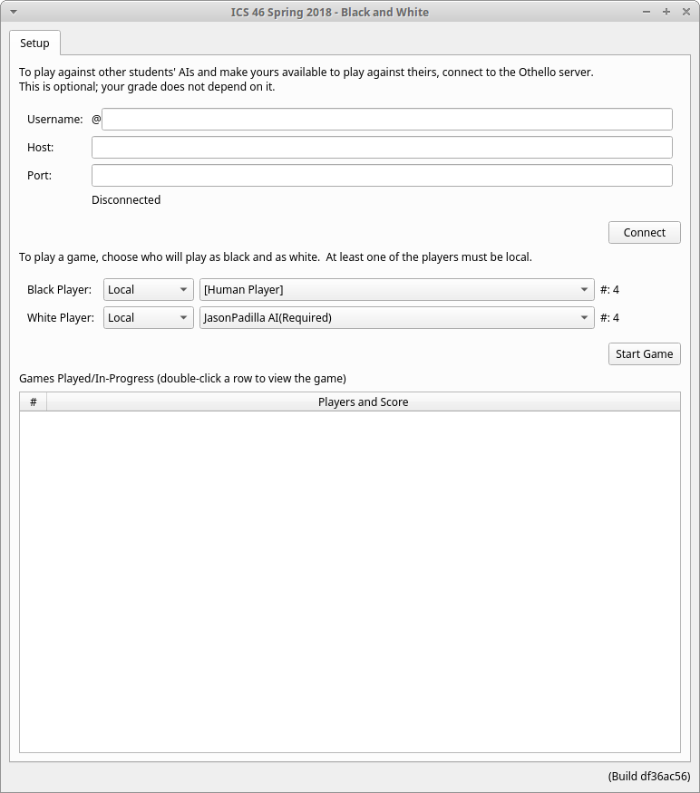
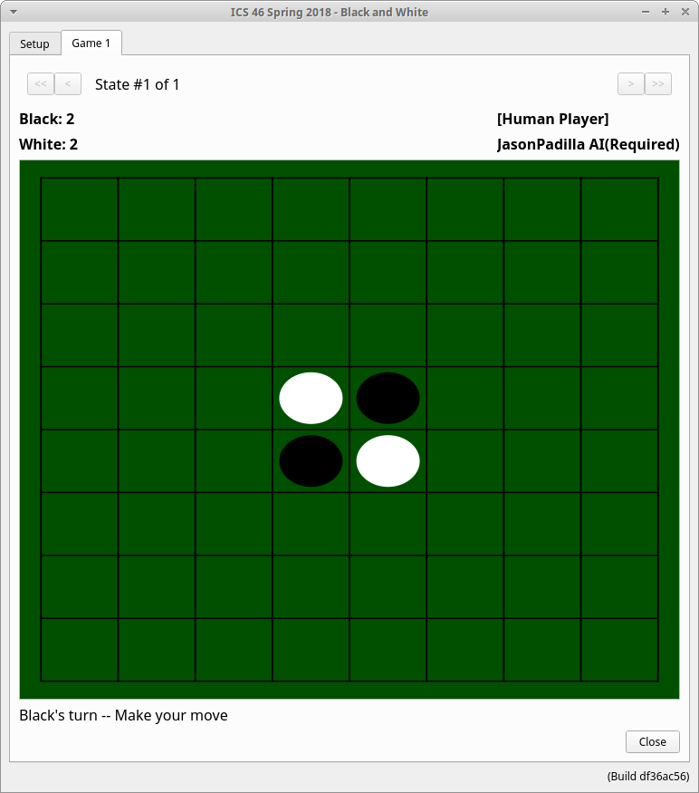
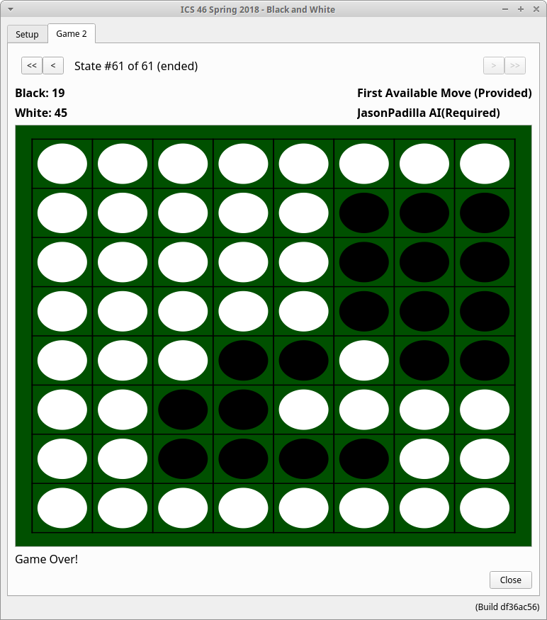
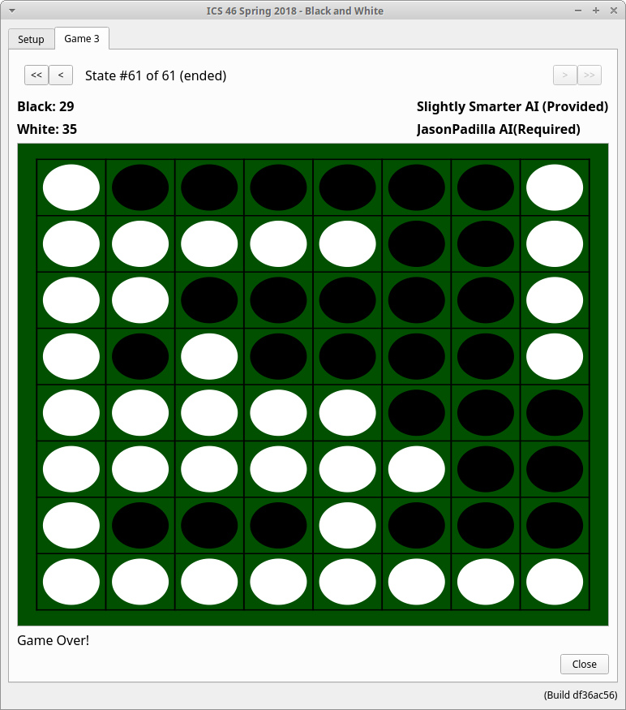

# :computer: Othello Game with an AI
This is a project that I created for one of my C++ classes while attending UCI. The goal of the project was to create an AI that could recurisvely look steps ahead
in order to beat its opponent. The AI can be set up to go against a person or another AI such as the ones provided, the First Available Move AI or the 
Slightly Smarter AI. The AI chooses its next move by first assuming that their opponent will choose their best possible move, then the AI will quantify every move 
available and compare them to get the best possible outcome. The AI basis its quantification of each move by pre-assigning a weight to each cell, certain cells hold more
weight because they can lead to a better outcome towards the end according to the rules of the game. The AI is able to compare different moves by recusively creating 
game states, it will look a few moves ahead and then return the state of each game, the move that resulted in the best state will be the move that the AI takes next.

# :pencil2: What I learned  
  * Recursion
  * Game State Analysis 
  * Artificial Intelligence

# :camera: Screenshots
Startup Screen             |  Initiated Game
:-------------------------:|:-------------------------:
  |  
First Available Move AI vs My AI        |  Slightly Smarter AI vs My AI
  |  
